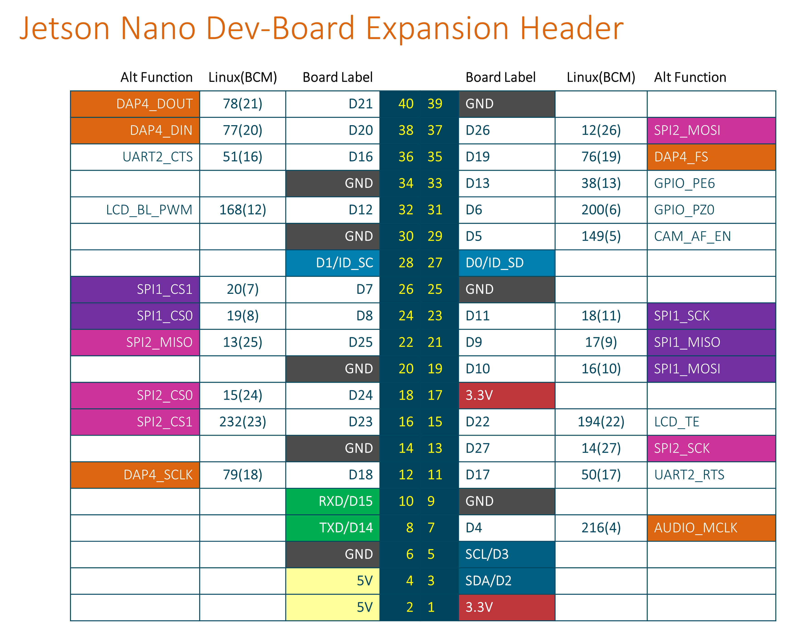

This is SP21 ECE445/ME470 code for team 24 at ZJUI

## GPIO Connections
| Charger | Red Pin | Green Pin |
|---------|---------|-----------|
| 0       | 9       | 10        |

GPIO pins are indexed in BCM mode:



## Setup GPIO Permission on Jetson Nano
Adapted from [JetsonGPIO README](https://github.com/pjueon/JetsonGPIO#setting-user-permissions)

In order to use the Jetson GPIO Library, the correct user permissions/groups must  
be set first. Or you have to run your program with root permission.

Create a new gpio user group. Then add your user to the newly created group.
```
sudo groupadd -f -r gpio
sudo usermod -a -G gpio $(whoami)
```
Install custom udev rules by copying the 99-gpio.rules file into the rules.d  
directory. The 99-gpio.rules file was copied from NVIDIA's official repository.

```
sudo cp lib/JetsonGPIO/99-gpio.rules /etc/udev/rules.d/
```

For the new rule to take place, you either need to reboot or reload the udev
rules by running:
```
sudo udevadm control --reload-rules && sudo udevadm trigger
```

## Setup on Jetson Nano

Ubuntu 18.04 for Jetson Nano has OpenCV 4.1.1 pre-installed.

### Install Boost
The Boost library from apt-get of Ubuntu 18.04 is too old. Building from source can be time-consuming as Jetson Nano
doesn't have powerful CPU. Instead, install newer Boost from other source.
```shell
sudo add-apt-repository ppa:mhier/libboost-latest
sudo apt-get update
sudo apt install -y libboost1.74-dev
```

If the error `dpkg-deb: error: paste subprocess was killed by signal (Broken pipe)` occurs, run the following commands.

```shell
sudo dpkg -i --force-overwrite /var/cache/apt/archives/libboost1.74-dev_1.74-0~16~ubuntu18.04.1_arm64.deb
sudo apt install -f libboost1.74-dev

## Build
```shell
git submodule update --init
mkdir build
cd build
cmake ..
make
```